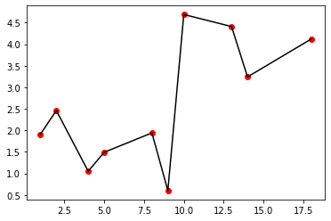

# DAA

# Visualisation for some generated input test cases

The above visualisation is done using matplotlib in python

## Time complexity and space complexity analyis for 3 test case samples

### Testcase 1

### Testcase 2

### Testcase 3
# For c=10

# For c=100

# For c=1000

