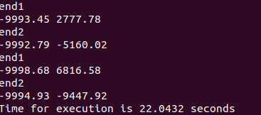

# DAA

# Algo Explanation
* We are given n set of points
* Our aim is to find the optimal no of segments and the best fit line segment for each segment
* Objective function is minimize "E + cL" where  E represents the Error (y-yi) the distance of each point from the best fit line
* "c" denotes the cost of adding additional line segment, which we  take from the user as input
* We calculate the error after minimising exploiting the idea of prefix sum using dynamic programming
* Each optimal line segment is represented as "ax+b" where "a" denotes "slope" and "b" denotes "intercept"
* we find the optimal values and print the segments to the console

# Visualisation for some generated input test cases

The above visualisation is done using matplotlib in python

## Time complexity and space complexity analyis for 3 test case samples

### Testcase 1

### Testcase 2

### Testcase 3
# For c=10

# For c=100

# For c=1000

## Analysis of results

